# VoxGen UI Audit — Full Structure

## App Map (Mermaid)

```mermaid
flowchart TD
    APP[VoxGen App Window]

    APP --> SIDEBAR[Sidebar Nav]
    APP --> OVERLAY[Overlay Window]

    SIDEBAR --> D[Dictation]
    SIDEBAR --> H[History]
    SIDEBAR --> SN[Snippets]
    SIDEBAR --> WN["What's New"]
    SIDEBAR --> SET[Settings]

    SET --> GEN[General]
    SET --> PROV[Providers]
    SET --> ENH[Enhancement]
    SET --> PROM[Prompts]
    SET --> PM[Power Modes]
    SET --> ACC[Account]
    SET --> ABT[About]

    GEN --> GEN1["Hold-to-Record hotkey (Change + Clear)"]
    GEN --> GEN2["Toggle hotkey (Change + Clear)"]
    GEN --> GEN3["AI Prompt hotkey (Change + Clear)"]
    GEN --> GEN4["Double-Tap hotkey (Change + Clear)"]
    GEN --> GEN5[Microphone dropdown]
    GEN --> GEN6[Language dropdown]
    GEN --> GEN7[Auto-paste toggle]
    GEN --> GEN8[Theme toggle]

    PROV --> PROV1[STT Provider radio: OpenAI / Groq / Local]
    PROV --> PROV2[Cleanup enabled toggle]
    PROV --> PROV3[Cleanup Provider radio: OpenAI / Groq]
    PROV --> PROV4[OpenAI API key: input + Save + Delete]
    PROV --> PROV5[Groq API key: input + Save + Delete]
    PROV --> PROV6[Code Mode toggle]
    PROV --> PROV7[Keyword Triggers toggle]
    PROV --> PROV8[Output Length radios: Concise / Medium / Detailed]
    PROV --> PROV9[Prompt Refinement toggle]

    ENH --> ENH1[Clipboard Context toggle]
    ENH --> ENH2[Active Window Context toggle]
    ENH --> ENH3[Filler Word Removal toggle]
    ENH --> ENH4[Custom Vocabulary: input + Add + per-word Delete]
    ENH --> ENH5[Word Replacements: 2 inputs + Add + per-item toggle + Delete]

    PROM --> PROM1["Prompt cards (predefined + custom): Edit + Delete + Activate"]
    PROM --> PROM2[Add Custom Prompt: icon + title + description + textarea]

    PM --> PM1[Enable Power Modes toggle]
    PM --> PM2["Mode cards: Enable toggle + Edit + Delete"]
    PM --> PM3["Mode form: emoji + name + app names + URL patterns + prompt dropdown + STT override + cleanup override"]

    ACC --> ACC1[Usage stats: words + minutes]
    ACC --> ACC2[Email input + Set Email button]
    ACC --> ACC3[License email + Activate button]
    ACC --> ACC4[Manage Subscription button]
    ACC --> ACC5[Clear License button]

    ABT --> ABT1[Version display]
    ABT --> ABT2[Check for Updates button]
    ABT --> ABT3[Install Update button]

    H --> H1[Open Recordings Folder button]
    H --> H2[Export button]
    H --> H3[Clear All button]
    H --> H4[Search input]
    H --> H5["Per card: Expand + Copy + Download .webm + Delete"]

    SN --> SN1[Import button]
    SN --> SN2[Export button]
    SN --> SN3["Add form: trigger + description + expansion + Add button"]
    SN --> SN4[Per snippet: Delete on hover]

    OVERLAY --> OV1[Idle: waveform bars — click opens prompt picker]
    OVERLAY --> OV2["Recording pill: Stop + Cancel"]
    OVERLAY --> OV3["Processing: spinner only"]
    OVERLAY --> OV4["Error state: auto-hides"]
    OVERLAY --> OV5["Trial expired: Own Key + Upgrade + Close"]
```

---

## Duplication & Overlap Map

| Problem | Elements | Location |
|---------|----------|----------|
| **4 hotkeys** doing similar jobs | Hold, Toggle, AI Prompt, Double-Tap | General |
| **STT provider** set in 2 places | Providers section + Power Modes form per-mode override | Providers + Power Modes |
| **Cleanup provider** set in 2 places | Providers section + Power Modes form per-mode override | Providers + Power Modes |
| **Prompt** set in 3 places | Prompts section, Overlay prompt picker, Power Modes form | Prompts + Overlay + Power Modes |
| **Code Mode** buried in Providers | Feels unrelated to API keys | Providers |
| **Keyword Triggers** buried in Providers | Content generation feature, not a provider concern | Providers |
| **Output Length + Prompt Refinement** buried in Providers | Cleanup behavior, not provider | Providers |
| **Filler Word Removal** in Enhancement | Overlaps with Default Cleanup prompt which also removes fillers | Enhancement + system-prompts.ts |
| **Clipboard + Window context** are both "AI context" | Could be one toggle or grouped differently | Enhancement |
| **Custom Vocabulary + Word Replacements** | Two different pre-processing inputs, easy to conflate | Enhancement |
| **Email** entered in 2 places | Account → Set Email + checkout modal on website | Account + Website |
| **Description field** on custom prompts | Mostly unused, adds form complexity | Prompts |
| **What's New** as a top-level nav item | Changelog is secondary info, not a primary destination | Sidebar |
| **Manage Subscription + Clear License** | Adjacent buttons with very different risk levels | Account |
| **History Export vs Download per card** | Two ways to export audio — global and per-item | History |

---

## Questions for UI/UX Expert

1. How should the 4 hotkeys be collapsed or simplified?
2. Which Providers settings belong in a different section?
3. Should Power Modes per-mode overrides replace the global provider selectors, or supplement them?
4. Is the Prompts section + Overlay picker + Power Modes prompt field too many ways to pick a prompt?
5. What should be cut entirely vs. moved vs. kept as-is?
6. What's the right sidebar structure (how many top-level items)?
7. Should Enhancement and Providers be merged into one section?
