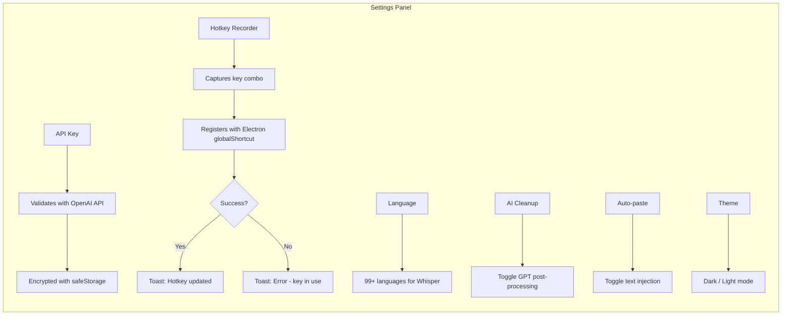
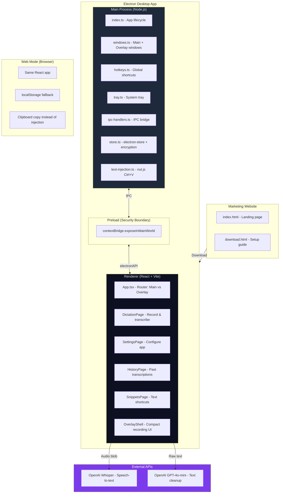
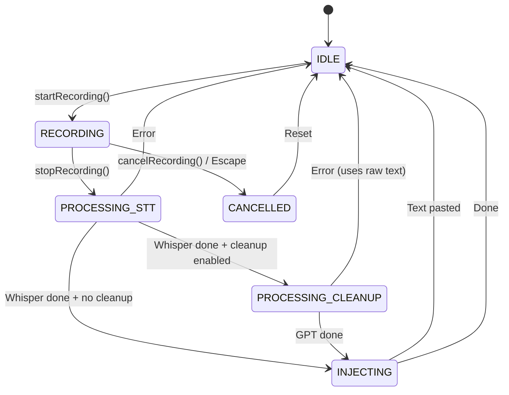

# VoiceFlow - User Journey

## Complete User Flow

```mermaid
graph TD
    subgraph Website["Website (Landing Page)"]
        A[Visit voiceflow website] --> B[Read features & how it works]
        B --> C[Click Download for Windows]
        C --> D[download.html - Setup instructions]
    end

    subgraph Install["Installation"]
        D --> E[Run VoiceFlow Setup.exe]
        E --> F[Windows SmartScreen - Run anyway]
        F --> G[App installs & launches]
        G --> H[App appears in system tray]
    end

    subgraph Setup["First-Time Setup"]
        H --> I[Open main window from tray]
        I --> J[Go to Settings page]
        J --> K[Paste OpenAI API key]
        K --> L{Key valid?}
        L -->|No| M[Show error - try again]
        M --> K
        L -->|Yes| N[Key saved & encrypted with DPAPI]
        N --> O[Configure hotkey - default Alt+Space]
        O --> P[Choose language]
        P --> Q[Toggle AI cleanup on/off]
        Q --> R[Setup complete - ready to dictate]
    end

    subgraph Dictation["Core Dictation Flow"]
        R --> S[User working in ANY app]
        S --> T[Press Alt+Space hotkey]
        T --> U[Overlay window appears]
        U --> V[Mic activates - start speaking]
        V --> W[Waveform visualization shows]
        W --> X[Press Alt+Space again to stop]
        X --> Y[Processing begins]
    end

    subgraph Processing["AI Processing Pipeline"]
        Y --> Z[PROCESSING_STT: Audio sent to Whisper API]
        Z --> AA[Raw transcription received]
        AA --> AB{AI cleanup enabled?}
        AB -->|Yes| AC[PROCESSING_CLEANUP: GPT-4o-mini cleans text]
        AB -->|No| AD[Use raw transcription]
        AC --> AE[Clean text ready]
        AD --> AE
        AE --> AF{Snippets defined?}
        AF -->|Yes| AG[Expand trigger words]
        AF -->|No| AH[Text finalized]
        AG --> AH
    end

    subgraph Injection["Text Injection"]
        AH --> AI[INJECTING: Copy text to clipboard]
        AI --> AJ[Simulate Ctrl+V via nut.js]
        AJ --> AK[Restore previous clipboard]
        AK --> AL[Overlay hides]
        AL --> AM[Text appears in focused app!]
        AM --> AN[Result saved to history]
        AN --> S
    end

    subgraph Cancel["Cancel Flow"]
        V --> BA[Press Escape]
        BA --> BB[Recording cancelled]
        BB --> BC[Overlay hides]
        BC --> S
    end

    style A fill:#7c3aed,color:#fff
    style AM fill:#22c55e,color:#fff
    style L fill:#eab308,color:#000
    style BA fill:#ef4444,color:#fff
```

## Settings Management Flow

```mermaid
graph LR
    subgraph Settings["Settings Panel"]
        S1[API Key] --> S2[Validates with OpenAI API]
        S2 --> S3[Encrypted with safeStorage]

        S4[Hotkey Recorder] --> S5[Captures key combo]
        S5 --> S6[Registers with Electron globalShortcut]
        S6 --> S7{Success?}
        S7 -->|Yes| S8[Toast: Hotkey updated]
        S7 -->|No| S9[Toast: Error - key in use]

        S10[Language] --> S11[99+ languages for Whisper]
        S12[AI Cleanup] --> S13[Toggle GPT post-processing]
        S14[Auto-paste] --> S15[Toggle text injection]
        S16[Theme] --> S17[Dark / Light mode]
    end
```

## Architecture Overview

```mermaid
graph TB
    subgraph Desktop["Electron Desktop App"]
        subgraph Main["Main Process (Node.js)"]
            M1[index.ts - App lifecycle]
            M2[windows.ts - Main + Overlay windows]
            M3[hotkeys.ts - Global shortcuts]
            M4[tray.ts - System tray]
            M5[ipc-handlers.ts - IPC bridge]
            M6[store.ts - electron-store + encryption]
            M7[text-injection.ts - nut.js Ctrl+V]
        end

        subgraph Preload["Preload (Security Boundary)"]
            P1[contextBridge.exposeInMainWorld]
        end

        subgraph Renderer["Renderer (React + Vite)"]
            R1[App.tsx - Router: Main vs Overlay]
            R2[DictationPage - Record & transcribe]
            R3[SettingsPage - Configure app]
            R4[HistoryPage - Past transcriptions]
            R5[SnippetsPage - Text shortcuts]
            R6[OverlayShell - Compact recording UI]
        end
    end

    subgraph Web["Web Mode (Browser)"]
        W1[Same React app]
        W2[localStorage fallback]
        W3[Clipboard copy instead of injection]
    end

    subgraph External["External APIs"]
        E1[OpenAI Whisper - Speech-to-text]
        E2[OpenAI GPT-4o-mini - Text cleanup]
    end

    subgraph Website["Marketing Website"]
        WS1[index.html - Landing page]
        WS2[download.html - Setup guide]
    end

    Main <-->|IPC| Preload
    Preload <-->|electronAPI| Renderer
    Renderer -->|Audio blob| E1
    Renderer -->|Raw text| E2
    Website -->|Download .exe| Desktop

    style Main fill:#1e293b,color:#e2e8f0
    style Renderer fill:#0c1020,color:#e2e8f0
    style External fill:#7c3aed,color:#fff
```

## Recording State Machine

```mermaid
stateDiagram-v2
    [*] --> IDLE
    IDLE --> RECORDING: startRecording()
    RECORDING --> PROCESSING_STT: stopRecording()
    RECORDING --> CANCELLED: cancelRecording() / Escape
    PROCESSING_STT --> PROCESSING_CLEANUP: Whisper done + cleanup enabled
    PROCESSING_STT --> INJECTING: Whisper done + no cleanup
    PROCESSING_CLEANUP --> INJECTING: GPT done
    INJECTING --> IDLE: Text pasted
    CANCELLED --> IDLE: Reset

    PROCESSING_STT --> IDLE: Error
    PROCESSING_CLEANUP --> IDLE: Error (uses raw text)
    INJECTING --> IDLE: Done
```
